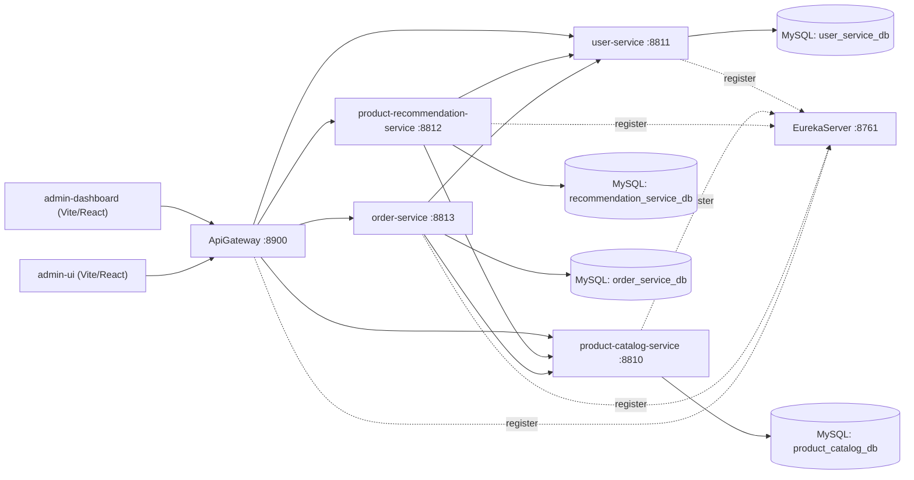

# Example502 - Microservices Commerce Platform

Example502 is a multi-service commerce demo built with Spring Boot, Spring Cloud, and React-based admin UIs.
It demonstrates service discovery, API gateway routing, inter-service communication, and separated data ownership per service.

## Highlights

- Service discovery with Eureka (`EurekaServer`)
- Centralized routing with Spring Cloud Gateway (`ApiGateway`)
- Independent business services for users, catalog, recommendations, and orders
- Two admin frontends (`admin-ui`, `admin-dashboard`)
- MySQL persistence with one database per backend service domain

## Architecture



## Technology Stack

- Java 17
- Spring Boot `3.2.5`
- Spring Cloud `2023.0.1`
- Spring Cloud Gateway + Eureka (Netflix)
- Spring Data JPA + MySQL
- OpenFeign
- Node.js + npm
- React + Vite (`admin-ui`, `admin-dashboard`)

## Project Structure

```text
example502/
|- EurekaServer/
|- ApiGateway/
|- user-service/
|- product-catalog-service/
|- product-recommendation-service/
|- order-service/
|- admin-ui/
`- admin-dashboard/
```

## Service Ports

| Component | Port | Notes |
|---|---:|---|
| EurekaServer | 8761 | Service registry dashboard |
| ApiGateway | 8900 | Main API entrypoint |
| user-service | 8811 | User APIs |
| product-catalog-service | 8810 | Catalog, category, review APIs |
| product-recommendation-service | 8812 | Recommendation APIs |
| order-service | 8813 | Order APIs |
| admin-dashboard | 5173 (default) | Vite dev server |
| admin-ui | 5173/5174 (auto) | Vite picks next free port |

## Gateway Routes

The gateway strips the first path segment (`StripPrefix=1`) and forwards requests:

| Gateway Prefix | Target Service | Example Through Gateway |
|---|---|---|
| `/accounts/**` | `user-service` | `GET /accounts/users` |
| `/catalog/**` | `product-catalog-service` | `GET /catalog/products` |
| `/shop/**` | `order-service` | `GET /shop/orders` |
| `/review/**` | `product-recommendation-service` | `GET /review/recommendations` |

## Prerequisites

1. JDK 17 installed and available in `PATH`
2. Maven 3.9+ installed
3. Node.js 20+ and npm installed
4. MySQL 8+ running locally
5. Available local ports listed above

## Database Notes

Each backend service uses its own database:

- `user_service_db`
- `product_catalog_db`
- `recommendation_service_db`
- `order_service_db`

The JDBC URLs include `createDatabaseIfNotExist=true`, so databases can be auto-created if the MySQL user has permission.
Default datasource user is `root` with blank password in `application.properties` (update for your environment).

## Quick Start (Manual)

Open separate terminals and run in this order.

### 1) Start Eureka

```powershell
cd EurekaServer
mvn spring-boot:run
```

### 2) Start backend services

```powershell
cd user-service
mvn spring-boot:run
```

```powershell
cd product-catalog-service
mvn spring-boot:run
```

```powershell
cd product-recommendation-service
mvn spring-boot:run
```

```powershell
cd order-service
mvn spring-boot:run
```

### 3) Start API Gateway

```powershell
cd ApiGateway
mvn spring-boot:run
```

### 4) Start frontends

```powershell
cd admin-dashboard
npm install
npm run dev -- --host 0.0.0.0
```

```powershell
cd admin-ui
npm install
npm run dev -- --host 0.0.0.0
```

## Verification Checklist

1. Open Eureka dashboard: `http://localhost:8761`
2. Ensure services are visible in Eureka with status `UP`
3. Call gateway endpoints:

```bash
curl http://localhost:8900/catalog/products
curl http://localhost:8900/accounts/users
curl http://localhost:8900/shop/orders
curl http://localhost:8900/review/recommendations
```

4. Open frontend apps:
- `http://localhost:5173`
- `http://localhost:5174` (if second app uses fallback port)

## Troubleshooting

- `Port already in use`
Use a different port or stop the process using that port first.

- `Cannot connect to MySQL`
Check MySQL service status, credentials, and firewall.

- `Services not showing in Eureka`
Start `EurekaServer` first, then restart the affected service.

- `404 on /actuator/health`
Actuator is not configured by default in this project.

## Development Tips

- Keep each service independent; avoid cross-service database access.
- Prefer calling other services through Feign clients.
- Keep gateway route mapping updated when adding new APIs.
- For production, replace wildcard CORS and plain local defaults with secure configuration.

